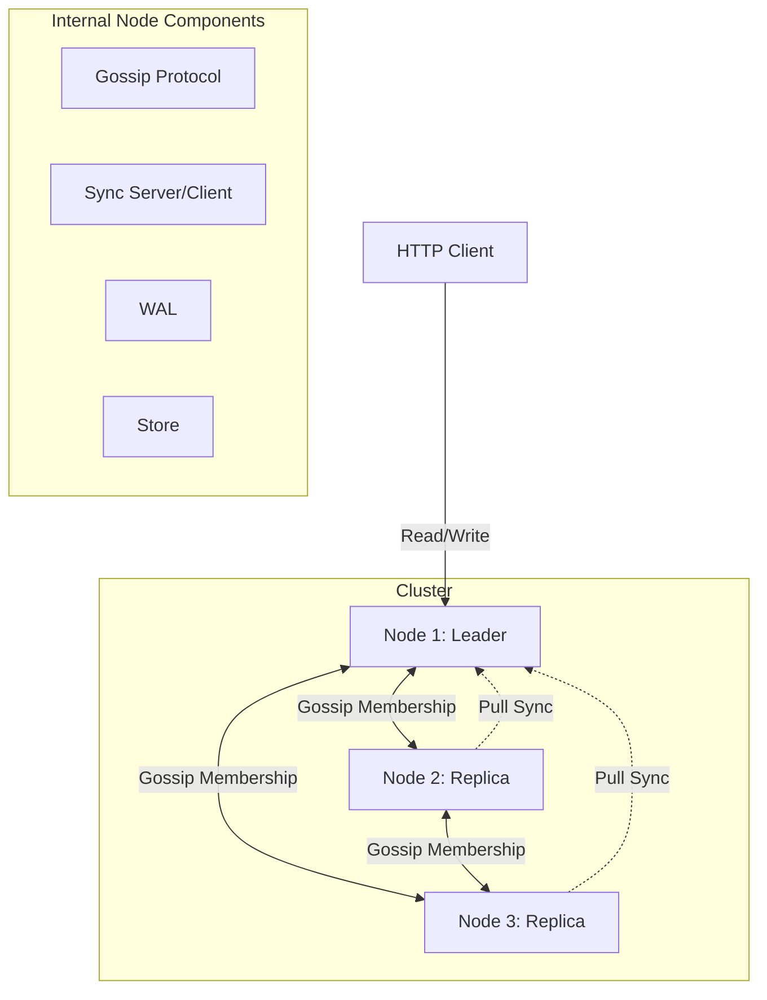

# GossipGridDB 

[](https://github.com/markosski/gossipgrid/actions/workflows/rust.yml)
[](https://opensource.org/licenses/MIT)

GossipGridDB is a distributed Key-Value (KV) database designed for high availability and partition-aware compute (WIP). It uses a gossip protocol for cluster membership and a leader/replica model for data consistency.

---

## State of the Project
*   **Heavily under development**: APIs and storage formats are subject to change.
*   **Work in progress**: Partition-aware compute and advanced performance optimizations are still being implemented.
*   **Not production-ready**: Use for experimental and learning purposes only.

## Features
- [x] **Gossip Protocol**: Decentralized cluster membership management
- [x] **Leader/Replica Model**: High availability via data replication
- [x] **Read-After-Write?**: Yes, with at least one replica ack
- [x] **Durability**: Write-Ahead Log (WAL) ensures data is not lost on crash
- [x] **Partitioning**: Efficient data distribution for horizontal scaling
- [x] **Rich Querying**: Support for partition and range keys
- [x] **Embeddable**: Easily integrate into your Rust applications
- [x] **Pluggable Storage**: Interfaces for custom storage backends (In-memory provided)
- [x] **Compute**: Execute Lua scripts on items within partition key range for server-side calculations
- [ ] **Partition-Aware Client**: Direct routing to the correct node for lower latency
- [ ] **Batch Writes**: Enhanced throughput for write-heavy workloads
- [ ] **WAL Compaction**: Reclaim disk space automatically, improved data recovery performance

## Architecture



## Performance Benchmarks
*Tested on a 3-node cluster, replication=2, partitions=9, c6a.large EC2 instances (EBS GP3 3000 IOPS), test duration - 10s.*

| Operation | Total Ops | Avg Latency | p90 | p95 |
| :--- | :--- | :--- | :--- | :--- |
| **Write (Replica Acknowledged)** | 9,409 | 3.07ms | 4.59ms | 4.94ms |
| **Write (Eventual)** | 36,292 | 686.55µs | 969.7µs | 1.26ms |
| **Read** | 56,416 | 433.91µs | 705.5µs | 810.91µs |

## Getting Started

### 1. Start a Local Cluster
You can spin up a 3-node cluster locally using the provided scripts:

```bash
# Start an ephemeral cluster
./start_local_cluster_3n.sh

# Or a named cluster (persists state)
./start_local_cluster_3n_named.sh
```

### 2. Interact with the API
Interact with the cluster using `curl`:

**Store an item:**
```bash
curl -H "Content-Type: application/json" -XPOST http://127.0.0.1:3001/items -d '{"partition_key": "user_123", "message": "JSON payload"}'
```

**Store items with range key:**
```bash
curl -H "Content-Type: application/json" -XPOST http://127.0.0.1:3001/items -d '{"partition_key": "user_123", "range_key": "transaction_10", "message": "{\"amount\": 100}"}'
curl -H "Content-Type: application/json" -XPOST http://127.0.0.1:3001/items -d '{"partition_key": "user_123", "range_key": "transaction_11", "message": "{\"amount\": 50}"}'
```

**Retrieve all items by partition key:**
```bash
curl -XGET http://127.0.0.1:3001/items/user_123
```

**Retrieve a specific item with range key:**
```bash
curl -XGET http://127.0.0.1:3001/items/user_123/transaction_10
```

**Register and execute a compute function:**
```bash
# Register a function
curl -H "Content-Type: application/json" -XPOST http://127.0.0.1:3001/functions -d '{
  "name": "sum_amounts",
  "script": "local sum = 0; local item = next_item(); while item ~= nil do sum = sum + item.data.amount; item = next_item(); end; return sum"
}'

# Execute function on items
curl -XGET "http://127.0.0.1:3001/items/user_123?fn=sum_amounts"

# List registered functions
curl -XGET http://127.0.0.1:3001/functions
```

## Testing

```bash
# Unit tests
cargo test --lib

# Integration tests (requires single-threaded execution currently)
RUST_LOG=info cargo test --test 'int_tests_*' -- --test-threads=4 --nocapture
```

## Documentation
Generate and open the rustdoc documentation:
```bash
cargo doc --no-deps --package gossipgrid --open
```

## License
Licensed under [Apache-2.0](http://www.apache.org/licenses/LICENSE-2.0).
